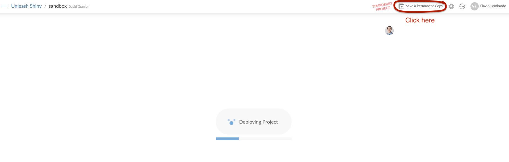
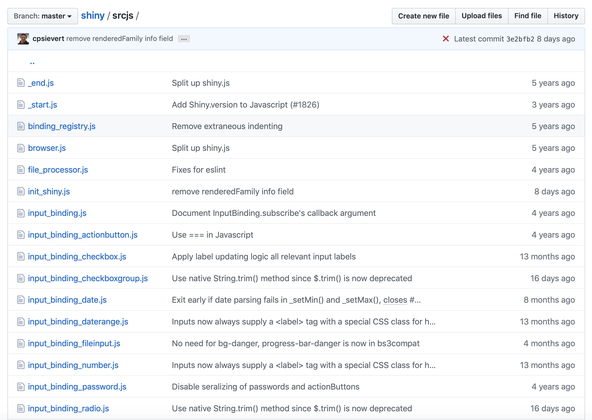
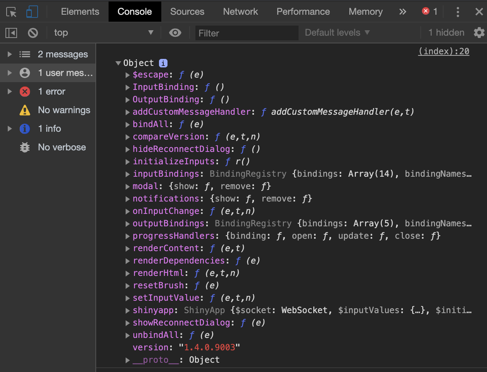
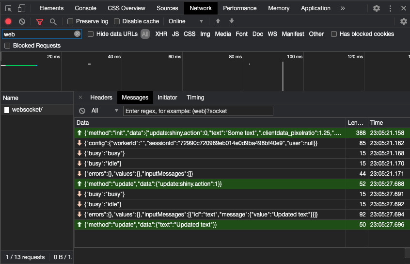
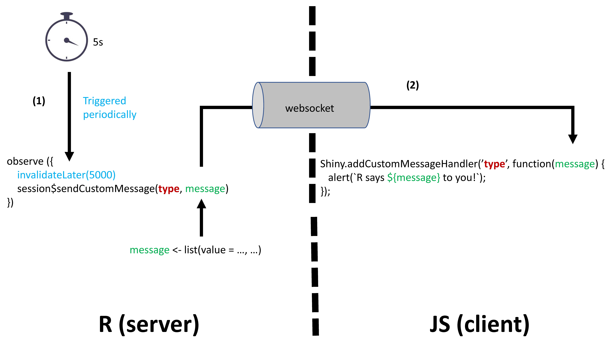
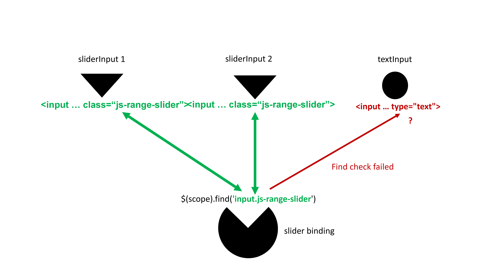
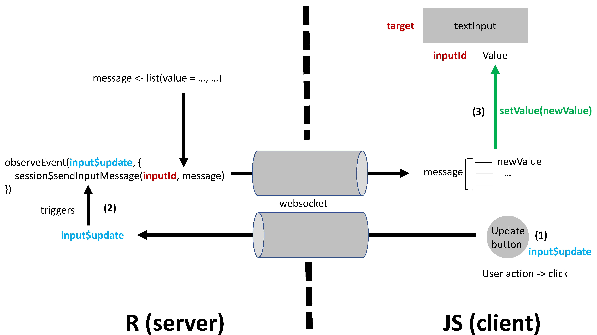
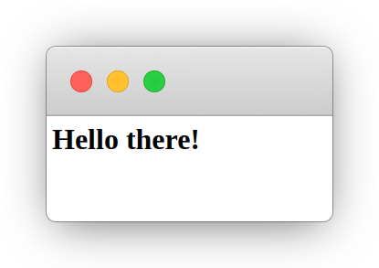

<style>
.title-slide {
  background-image: url(assets/img/bg/front_cover.jpg);
  background-size: cover;
}
</style>

```{r setup, include = FALSE}
if(!requireNamespace("emo", quietly = TRUE))
  remotes::install_github("hadley/emo")

if(!requireNamespace("DiagrammeR", quietly = TRUE))
  install.packages("DiagrammeR")

library(emo)
library(countdown)
library(shiny)
library(htmltools)
library(charpente)
library(XML)
xaringanExtra::use_xaringan_extra(c("tile_view", "animate_css", "tachyons"))
xaringanExtra::use_extra_styles(
  hover_code_line = TRUE,         #<<
  mute_unhighlighted_code = TRUE  #<<
)
xaringanExtra::use_panelset()

# lighten cli messages for better slide rendering
html_2_R <- function(html, prefix = FALSE) {
  r_output <- html %>%
   htmlParse() %>%
    getNodeSet("/html/body/*") %>%
    `[[`(1) %>%
    charpente:::render_node(prefix = prefix)

  if (exists("r_output")) {
    cli::cli_code(styler::style_text(r_output))
  } else {
    cli::cli_alert_danger("Failed to convert code.")
  }
}

```

```{r js4shiny, echo=FALSE}
js4shiny::html_setup(stylize = c("fonts", "variables", "code"))
```

# About us

.flex.tc[
.w-30.mr3[

.f5[David]

.small[Data Scientist at Novartis]

.gray[&commat;divadnojnarg]
]

.w-30.mr3[

.f5[John]

.small[Data scientist at the World Economic Forum]

.gray[&commat;jdatap]
]


.w-30.mr3[

.f5[Colin]

.small[Shiny Expert at ThinkR]

.gray[&commat;_ColinFay]
]
]

---
# Program

We're in for 4 hours of **fun**!

- Grab a `r ji("coffee")`
- Make yourself comfortable `r ji("couch")` or 🧘
- Ask questions `r ji("question")`  

1. Intro + Quiz (5 min)
2. Develop **custom templates** with Shiny (45 min)
3. `r ji("coffee")` + `r ji("question")` (10 min) (total: 1h)
4. Unleash Shiny's interactivity (80 min)
5. `r ji("coffee")` + `r ji("question")` (10 min) (total: 2h30)
6. Innovative approach to **custom outputs** (60 min)
7. `r ji("coffee")` + `r ji("question")` (10 min) (total: 3h40)
8. Shiny's **hidden** or **less documented** features  (20 min) (total: 4h)

.footnote[
Disclaimer: this workshop is not about **building** Shiny Apps!!!
]

---
# Workshop Material

  - Slides: https://rinterface.com/shiny/talks/RPharma2020/#1
  - For a plug and play experience, we created a [Rstudio Cloud](https://rstudio.cloud/spaces/92568/join?access_code=kqUUGAOZMMHSZoAQBrQ1GHSOBxSE4u1q8JvrJoRs) project with everything installed for you

.center[
https://rstudio.cloud/spaces/92568/join?access_code=kqUUGAOZMMHSZoAQBrQ1GHSOBxSE4u1q8JvrJoRs
]
  
  - To avoid **connection issues**, disconnect from your **VPN**!
  - Somes slides contain code that you may run (a **sandbox** space is available in RStudio Cloud)
  
```{r rstudio-cloud-init, echo=FALSE, out.width='100%'}

```

---
class: break center middle
background-image: url('assets/img/bg/intro.jpg')
background-size: cover

.center[
<h3 class="white absolute bottom">Introduction</h3>
]


---
class: center

# Shiny or not Shiny?
<div class="device device-iphone-8 device-spacegray" style="position: absolute; left: 0; right: 0;
top: 0; bottom: 0; margin: auto; max-width: 100%; max-height: 100%; transform: scale(0.6);">
<div class="device-frame">
<iframe width="100%" src="https://shiny.john-coene.com/coronavirus/" allowfullscreen="" frameborder="0" height="100%" scrolling="auto"></iframe>
</div>
<div class="device-stripe"></div>
<div class="device-header"></div>
<div class="device-sensors"></div>
<div class="device-btns"></div>
<div class="device-power"></div>
</div>

---
# Shiny or not Shiny?

<div class="device device-macbook-pro device-spacegray" style="position: absolute; left: 0; right: 0;
top: 0; bottom: 0; margin: auto; max-width: 100%; max-height: 100%; transform: scale(1);">
<div class="device-frame">
<iframe width="100%" src="https://themeon.net/nifty/v2.9.1/widgets.html" allowfullscreen="" frameborder="0" height="100%" scrolling="auto"></iframe>
</div>
<div class="device-stripe"></div>
<div class="device-header"></div>
<div class="device-sensors"></div>
<div class="device-btns"></div>
<div class="device-power"></div>
</div>

---

# Shiny or not Shiny?

<div class="device device-macbook-pro device-spacegray" style="position: absolute; left: 0; right: 0;
top: 0; bottom: 0; margin: auto; max-width: 100%; max-height: 100%; transform: scale(1);">
<div class="device-frame">
<iframe width="100%" src="https://dgranjon.shinyapps.io/shinyMons/" allowfullscreen="" frameborder="0" height="100%" scrolling="auto"></iframe>
</div>
<div class="device-stripe"></div>
<div class="device-header"></div>
<div class="device-sensors"></div>
<div class="device-btns"></div>
<div class="device-power"></div>
</div>

---

# A simple Shiny app

#### No HTML/CSS/JS and it just works `r ji("fear")`! What kind of **magic** is this?

<iframe src="https://gallery.shinyapps.io/050-kmeans-example" height="400px" width="100%"></iframe>


---
<video style="position: fixed;
  right: 0;
  bottom: 0;
  min-width: 100%;
  min-height: 100%;
  width: 100%; "loop="" autoplay="" poster="assets/img/bg/virtual_patient.png">
<source src="assets/movies/VirtualPatient.mp4" type="video/mp4">
</video>

---
class: break center middle
background-image: url('assets/img/bg/part1.jpg')
background-size: cover

<h3 class="white absolute bottom center">Part 1. Custom Templates with Shiny</h3>

---
class: header_background
# A. Shiny generates HTML from R
## Warm up 1
1. Run the following code:

```{r, eval=FALSE}
p("Hello World")
```

2. Copy and paste this code to the R console. What do you observe?

---
class: header_background
# A.1.1 Introduction to HTML: **tags**
## The simplest HTML skeleton
.pull-left.mh-a[
```html
<!DOCTYPE HTML>
<html>
  <head>
  <!-- head content here -->
  </head>
  <body>
  <!-- body content here -->
  </body>
</html>
```
]

.pull-right.small[
There are 2 types of **tags**:
  - paired-tags:`<div></div>`
  - self closing tags: ``
  
We classify them by usage:

  - structural tags: `<head></head>`, `<body></body>`
  - control tags: `<script></script>`, `<button></button>`
  - formatting tags: `<font></font>`
  
Block vs inline:

  - `<div><p>Hello World</p></div>`: .green[Good]
  - `<span><div><p>Hello World</p></div></span>`: .red[not good]
]

---
class: header_background
# A.1.2 Introduction to HTML: **attributes**
## Attributes specify the tags properties
.pull-left.mh-a[
```html
<div class="awesome-item" id="myitem"></div>
<!-- the class awesome-item may be applied to multiple tags -->
<span class="awesome-item"></span>
```
]


.pull-right[
The most common attributes:
  - **class** may be shared between multiple tags
  - **id** is unique
  - non standards attributes like `data-toggle`
]

<br>

Attributes are used by **CSS** and **JavaScript** to **interact** with the web page!

---
class: header_background
# A.2 About the Document Object Model

.pull-left.w-50.mt4.small[
DOM is a convenient representation (tree) of the HTML document. We inspect the code of any web page with Firefox or Chrome:

  - after a right click and selecting inspect
  - after clicking on **F12** (windows), **fn + F12** (Mac)
  
```r
library(shiny)
ui <- fluidPage(p("Hello World"))
server <- function(input, output) {}
shinyApp(ui, server)
```

  1. Run the above app, right click on the only text element and select inspect
  2. In the `Elements` panel, double click between the `<p></p>` tag to edit the current text. Press enter when finished
]

.pull-right.w-50.mt4[
```{r html-dom, echo=FALSE, out.width='85%'}
knitr::include_graphics("assets/img/html_DOM.png")
```
]

---
class: header_background
# B. Unleash `{htmltools}` 
`{htmltools}` is a R package designed to:
  - **Generate** HTML tags from R
  - Handle **web dependencies**: add, remove, resolve, ...

Historically, `{htmltools}` was extracted out of `{shiny}` to extend it. That's why, both packages have many common functions! 

At the moment, `{htmltools}` does not have any user guide, although being an important package for all web things
[](https://cran.r-project.org/package=htmltools)

---
class: header_background
# C. Discover Shiny dependencies
## Warm up 2

Let's play `r ji("play")`:

  1. Run the app `runExample("01_hello")`
  2. Open the HTML inspector
  3. Delete the bootstrap.min.css and ion.rangeSlider.css
  4. Conclusions

The `htmtools::findDependencies` function allows to get the dependencies from a tag.

```r
findDependencies(fluidPage())
``` 

---
class: header_background
# C.1.1 Handle dependencies
## How would you include JS/CSS in a Shiny app?

.pull-left.w-30.mh-a.small[
Works but not **portable**

```r
fluidPage(
  tags$head(
    tags$style(...),
    tags$script(src = "path-to-script"),
    tags$script(
      "$(function() {
       // JS logic ...
      });
      "
    )
  )
)
```
]

.pull-right.w-70.mh-a.small[
With `{htmltools}`, we define the dependency with `htmlDependency`, then attach it to a tag with `tagList`:

```r
use_bs4_dep <- function(tag) {
  bs4_dep <- htmlDependency(
    name = "Bootstrap 4",
    version = "1.0",
    src = c(href = "https://maxcdn.bootstrapcdn.com/bootstrap/4.0.0/css/"),
    stylesheet = "bootstrap.min.css"
  )
  tagList(tag, bs4_dep)
}
use_bs4_dep(fluidPage())
```
]


---
class: header_background
# C.1.2 From HTML to R `r ji("wizard")`
## HTML VS R
.pull-left.w-50.mh-a[
In HTML, we have:
```html
<div class="divclass" id = "daddy">
  <h1>A child</h1>
  <span class="child" id="baby">Crying</span>
</div>
```
]

.pull-right.w-50.mh-a[
The corresponding R code is 

```{r}
mytag <- div(
  class = "divclass",
  id = "daddy",
  h1("A child"),
  span(class = "child", id = "baby", "Crying")
)
```
]

Some tags like `<nav></nav>` need the `tags$` prefix before (`tags` is a list of functions). The `withTags` function to use `tags$<tagName>`


---
class: header_background
# C.1.3 Automate the conversion? 
This process is **not interesting** and **time consuming**!

.center[
```{r charpente, echo=FALSE, out.width='15%'}

```
]

.pull-left.small[
Tools exist:
 
  - html2R [Shiny app](https://alandipert.shinyapps.io/html2r/) converts HTML to R (thanks Alan Dipert)
  - `{charpente}` does the same from the R console with `html_2_R` 
]

.pull-right.small[
Code conversion by `{charpente}`
```{r}
html_2_R('<div class="divclass" id = "daddy"></div>')
```
]


---
class: header_background
# C.2.1 Accessing R tags attributes
How to access name, attributes, children?

We could use `str(mytag)` to inspect the structure of the R object.

.pull-left[
```{r}
mytag$attribs 
```
]

.pull-right[
```{r}
mytag$children
```
]

---
class: header_background
# C.2.2 Manipulate R tags
## Add new attributes
There are 2 methods:

  - `tagAppendAttributes(tag, list of attributes)` is preferred
  - `tag$attribs[["new-attribute"]] <- value`

## Add child/children
  - `tagAppendChild(tag, child)`
  - `tagAppendChildren(tag, list of children)`

There exist other functions but we'll not use them.


---
class: header_background
# C.2.3 Programmatically create elements
.mt4[Let's create 5 `span` tags!]

.pull-left-30.mt2[
```r
div(
  span(1),
  span(2),
  span(3),
  span(4),
  span(5)
)
```

What about 100 tags `r ji("fear")`?

]

.pull-right-70.mt2[
With some **functional** programming!
```r
# base R
div(lapply(1:5, function(i) span(i)))
# purrr + %>%
map(1:5, function(i) span(i)) %>% div()
```
]


---
class: header_background
# D. Practice: bulma
In the following, you'll reconstruct the `{shinybulma}` package step by step!
.center[
```{r shinybulma, echo=FALSE, out.width='20%'}
knitr::include_graphics("assets/img/shinybulma.svg")
```
]

Main tasks:
  - Import [bulma](https://bulma.io/) dependencies
  - Generate the main `page` function 
  
Lets' start! Open [`shinybulma.Rmd`](https://rstudio.cloud/spaces/92568/project/1729918) and enjoy `r ji("monkey")`

`r countdown(25)`

---
class: break center middle
background-image: url('assets/img/bg/part2.jpg')
background-size: cover

<h3 class="white absolute bottom center">Part 2. Unleash Shiny's Interactivity </h3>

---
class: header_background
# A.1 Inputs are key to interactivity
.pull-left.w-50.mh-a.mt4[
**Inputs** are key elements of web applications. They drive user **interactions** like:

  - configure parameters
  - fill and submit a form
  - ...

<br>

`{shiny}` brings various inputs like `sliderInput`, `numericInput`, ...
  
]

.pull-right.w-50.mt4[
<div class="device device-iphone-8 device-spacegray" style="position: absolute; left: 50;
top: 50; bottom: 0; margin: auto; max-width: 100%; max-height: 100%; transform: scale(0.6);">
<div class="device-frame">
<iframe width="100%" src="https://gallery.shinyapps.io/081-widgets-gallery" allowfullscreen="" frameborder="0" height="100%" scrolling="auto"></iframe>
</div>
<div class="device-stripe"></div>
<div class="device-header"></div>
<div class="device-sensors"></div>
<div class="device-btns"></div>
<div class="device-power"></div>
</div>
]

<br>

.center[
How does all this even work `r ji("fairy")`?
]

---
class: header_background
# A.2 Shiny heavily relies on JavaScript (JS)
.pull-left.w-50.mt4[
 One very big `shiny.js`<sup>*</sup> responsible for:

  - registering input/output
  - handling every single input/output action
  - initializing and controlling the **websocket** `r ji("socks")` (the whaaaat?)
  - handling alerts/modals/notifications
  - ...

.center[
```{r shiny-homer-gif, echo=FALSE, out.width='25%'}
knitr::include_graphics("assets/img/shiny-input-homer.gif")
```
]
  
]

.pull-right.w-50.mt4[
```{r shiny-js-sources, echo=FALSE, out.width='100%'}

```
]

.footnote.small[
<sup>*</sup> JS source may be found [here](https://github.com/rstudio/shiny/tree/master/srcjs).
In short all these files are **concatenated**, giving **shiny.js** and **shiny.min.js**!
]

---
class: header_background
# A.2.1 Introduction to JS and jQuery

1. Primary role: create **dynamic** and **interactive** pages
2. How? **Interact** with the **DOM** elements (modify, remove, add)
3. JS is run on the **client** (web browser)
4. JS is **object oriented**

.pull-left-30[
```js
var myNumber = 1; // affectation
myNumber--; // decrement
console.log(myNumber); // print 0
```
]

.pull-right-70[
```js
const you = {
  name: 'your name', // property
  music : 'your favorite music',
  printName: function() { // method
    console.log(`I am ${this.name}`); // here "this" is the object
  }
}

you.geek = true; // add extra property
```
]

---
class: header_background
# A.2.2 jQuery, "Write less, do more"
jQuery is a JS **library**, not another language!
.center[
```js
var $ = jQuery; // usually you don't need this since Shiny already does it
$(selector).action(); // jQuery's philosophy
```
]

---
class: header_background
# A.2.3 jQuery and CSS selectors
In the next steps, we'll have to **select** elements from the DOM.

<iframe src="https://www.w3schools.com/jquery/trysel.asp" height="400px" width="100%"></iframe>

---
class: header_background
# A.2.4 jQuery and event listeners
An **event listener** is a program that **triggers** when a given event **occurs**, like after a mouse click.

.mh-a.small[
```html
<button id="mybutton">Go ! </button>
```
]

.pull-left.small[
With **vanilla JS**:
```js
var btn = document.getElementById('mybutton'); // select the button
btn.addEventListener('click', function() { // action + consequences
  alert('You clicked me!'); // action
});
```
]

.pull-right.small[
With **jQuery**:
```js
$('#mybutton').on('click', function() {
  alert('You clicked me!');
});
```
]

Hopefully you are convinced that jQuery is less **verbose** than pure JS!

---
class: header_background
# A.3.1 R and JS
Let's consider the following app
.pull-left.w-50.small[
```r
ui <- fluidPage(
  textInput("text", "My text", "Some text"),
  actionButton("update", "Update")
)

server <- function(input, output, session) {
  observeEvent(input$update, {
    updateTextInput(session, "text", value = "Updated text")
  })
}

shinyApp(ui, server)
```
]

.pull-right.w-50[
Waiiit!!

  - How does JS knows that R wants to update the text value `r ji("question")` 
  - How does Shiny knows when to send back the updated text to R `r ji("question")`
]

---
class: header_background
# A.3.2 The Shiny JS object
Did you know that `Shiny` is also a JavaScript object `r ji("question")` 

.pull-left.w-50.small[
Run this app and open the HTML inspector.

```r
ui <- fluidPage(
  tags$script(
    "$(function() {
      console.log(Shiny);
    });
    "
  )
)
server <- function(input, output) {}
shinyApp(ui, server)
```

]

.pull-right.w-50[
```{r shiny-object, echo=FALSE, out.width='90%'}

```
]

---
class: header_background
# A.3.3 The websocket
This is the magic piece allowing **bidirectional** communication between R and JavaScript. The technology behind is provided by `{httpuv}` and `{websocket}`.

.pull-left.w-50[
1. Run the previous app
2. Open the HTML inspector
3. Select the `Network` tab
4. Search for websocket
5. Play with the app and observe!
]

.pull-right.w-50[
```{r inspect-websocket, echo=FALSE, out.width='100%'}

```
]

---
class: header_background
# A.3.4 From R to JS, from JS to R

On the R side `session` is an instance of the `ShinySession` R6 class allowing to send **messages** to JS.
.pull-left.w-50.small[
2 main methods:
  - **`sendCustomMessage`** sends R messages to JS
  - **`sendInputMessage`** sends R messages to **input bindings**

<br>

`Shiny.addCustomMessageHandler` is the JS part of `session$sendCustomMessage`.
Both are linked by the **type** parameter!
]

.pull-right.w-50[
```{r from-R-to-JS, echo=FALSE, out.width='100%'}

```
]

---
class: header_background
# A.4 Bulma JS for Shiny
In this part you'll need to work on the following RStudio Cloud [project](https://rstudio.cloud/spaces/92568/project/1729929). We split the audience in 3 groups (1 instructor per group). Each group will choose between:

  - Notifications, doc [here](https://bulmajs.tomerbe.co.uk/docs/0.11/2-core-components/notification/)
  - Modal, doc [here](https://bulmajs.tomerbe.co.uk/docs/0.11/2-core-components/modal/)
  
After the workshop, you'll have the **opportunity** to bring this change to the [shinybulma](https://github.com/RinteRface/shinybulma/tree/master) repository.

`r countdown(20)`


---
class: header_background
# B.1.1 The Shiny input system
## Input tag structure
Input tags have various HTML structure.

```html
<input id = inputId type = "text" class = "input-text" value = value>
```

The simplest is probably the text input:

 - **id** guarantees the input **uniqueness**. <sup>1</sup>
 - **type** define the input type
 - **class** is generally targeted by JavaScript: `$('.input-text').action();`
 - **value** holds the input value
 
.footnote.small[
<sup>1</sup> All instances of the same input share a unique **input binding**. Hence, id is **mandatory**!
]

---
class: header_background
# B.1.2 The Shiny input system
## Binding Shiny inputs
An input binding: 
 - Allows Shiny to **identify** each **instance** of a given input 
 - Describes what you **may do** with it.
 - **Receives messages** from R ...
 - ... tells **when** Shiny has to update the value for R
 
🗒 Bindings rely on a JS class defined in the input_binding.js [file](https://github.com/rstudio/shiny/blob/master/srcjs/input_binding.js)

```js
var customTextBinding = new Shiny.InputBinding();
```

In the following, we'll need `devtools::install_github("DivadNojnarg/OSUICode")`

---
class: header_background
# B.2.1 The binding steps: **find**
The idea is to **locate** the input in the DOM. 

.pull-left.w-50.small[
We generally filter by **class**, **scope** being the **document**.

```js
find: function(scope) {
  console.log($(scope).find('.input-text'));
  return $(scope).find('.input-text');
}
```

Run the following and open the HTML inspector.

```r
library(OSUICode)
customTextInputExample(1)
```
]

.pull-right.w-50[
```{r shiny-find-input, echo=FALSE, out.width='100%'}

```
]

---
class: header_background
# B.2.3 The binding steps: **get the value**
This step ensures that R **gets** the input **value** at any time. The jQuery `val` method allows to get the current value.

.pull-left.w-50[
```js
getValue: function(el) {
  return $(el).val();
}
```
]

.pull-right.w-50[
1. Run the following and open the HTML inspector
2. Update the text content
3. What happens? Why?

```r
customTextInputExample(2)
```
]

---
class: header_background
# B.2.4 The binding steps: **set and update**
.small[
`setValue(el, value)` is used to set the input value. It called within `receiveMessage(el, data)`, which is the JS part of all the R `updateInput` functions.
]

.pull-left.w-50.small[
```js
setValue: function(el, value) {
  $(el).val(value);
}

receiveMessage: function(el, data) {
  console.log(data);
  if (data.hasOwnProperty('value')) {
    this.setValue(el, data.value);
  }
  // other parameters to update...
}
```

Run the following and open the HTML inspector. Why doesn't the output value change?

```r
updateCustomTextInputExample(3)
```
]

.pull-right.w-50[
```{r shiny-update-input, echo=FALSE, out.width='100%'}

```
]

---
class: header_background
# B.2.5 The binding steps: **subscribe**

.pull-left.w-70.small.mt2[
`subscribe(el, callback)` **listens** to **events** defining Shiny to update the input value and make it available in the app. For a text input, we might have:

```js
subscribe: function(el, callback) {
  // when updated
  $(el).on('change.customTextBinding', function(event) {
    callback(false);
  });
  
  // keyboard, copy and paste, ...
  $(el).on('keyup.customTextBinding input.customTextBinding', function(event) {
    callback(true);
  });
}
```
]

.pull-right.w-30.small.mt2[
Run the following demonstration.
```r
updateCustomTextInputExample(4)
updateCustomTextInputExample(5)
```
]

**callback()** tells to update the input on the server (R). If true, a **rate policy** is applied!

---
class: header_background
# B.2.6 The binding steps: **rate policies**
As mentioned before, `callback(true)` will set rate policy for the given **event listener**. Setting a rate policy is relevant when we don’t want to flood the server with tons of update requests.

.pull-left.w-50.small[
```js
getRatePolicy: function() {
  return {
    // Can be 'debounce' or 'throttle'
    policy: 'debounce',
    delay: 500
  };
}
```
]

.pull-right.w-50.small[
Below, the text input only updates after releasing the keyboard for 250ms.

```r
updateCustomTextInputExample(6)
```
]

---
class: header_background center
# B.2.7 The binding steps: Recap

.mt-50[
<video width="80%" style="margin-top: 25px;">
<source src="assets/movies/input-binding-steps.mov" type="video/mp4">
</video>
]


---
class: header_background
# B.3 Box on Steroids!
.mt-4[
Boxes are a center element of `{shinydashboard}`. Yet the latter only exploit 10% of their
capability. Your mission: unleash the AdminLTE API to deliver box on steroids! Open [`box_on_steroids.Rmd`](https://rstudio.cloud/spaces/92568/project/1729937).
]


`r countdown(20)`

---
class: break center middle
background-image: url('assets/img/bg/part3.jpg')
background-size: cover

<h3 class="white absolute bottom center">Part 3. Custom Outputs</h3>

---
class: header_background
# A.1 Structure

A brief plan of this part of the workshop

Serve data as an __HTTP response__ and read it in JavaScript to produce an HTML __output.__`r emo::ji("impressed")`

1. Discover HTTP 1.1 `r ji('globe_with_meridians')`.
2. Learn to serve HTTP 1.1 in shiny
3. Exercise in `Unleash-Shiny-Exercises-Part-3` RStudio Cloud.
4. Discover shiny outputs `r emo::ji("arrow_right")`
5. Exercise in `Unleash-Shiny-Exercises-Part-3` RStudio Cloud.
6. Q&A `r ji("question")`

_Have `Unleash-Shiny-Exercises-Part-3` ready, it will come in handy._

---
class: header_background
# A.1 Multi page applications `r ji("page")` `r ji("page")` `r ji("page")`

"Traditional" applications and websites

.pull-left.w-70.mh-a[
```{r, echo=FALSE, fig.align='center', out.width="100%", fig.dim=c(3, 6)}
DiagrammeR::grViz("
strict digraph{
  graph[rankdir=LR fontsize = 10]
  node [shape=record fontsize=10];
  s [label='Server' color=mediumpurple];
  c [label='Client' color=gold];
  c -> s [color=dimGray arrowsize=.3 label=request fontsize = 9];
  s -> c [color=dimGray arrowsize=.3 label=response fontsize = 9];

  c1 [label='Client' color=gold];
  c1 -> s [color=dimGray arrowsize=.3 label=request fontsize = 9];
  s -> c1 [color=dimGray arrowsize=.3 label=response fontsize = 9];
}
")
```
]

.pull-right.w-70.mh-a[
  ### HTTP 1.1

  _A new page is requested_

  - Client requests `/`, server responds
  - Client requests `/about`, server gives a different response
  - Client requests `/products`, server gives a yet a different response
  - and so on

  `r emo::ji("bulb")` Think {plumber}
]

---
class: header_background
# A.1.1 Single page applications `r ji("page")`

A more recent web development.

.pull-left.w-70.mh-a[
```{r, echo=FALSE, fig.align='center', out.width="100%", fig.dim=c(3, 6)}
DiagrammeR::grViz("
digraph{
  graph[rankdir=LR fontsize = 10]
  node [shape=record fontsize=10];
  s [label='Server' color=mediumpurple];
  c1 [label='Client' color=gold];
  c2 [label='Client' color=gold];
  c3 [label='Client' color=gold];
  c1 -> s [dir=both color=dimGray arrowsize=.3 label=messages fontsize = 9];
  c2 -> s [dir=both color=dimGray arrowsize=.3 label=messages fontsize = 9];
  c3 -> s [dir=both color=dimGray arrowsize=.3 label=messages fontsize = 9];
}
")
```
]

.pull-right.w-70.mh-a[
  ### Websocket

  _Bi-directional communication_

  1. Client connects
  2. Client sends message
  3. Server (may) respond with another message
  4. Back to point 2
]

---
class: header_background
# A.1.2 What about shiny?

So which one of those does shiny use?

> Both!

But one (probably) more than the other...

When you visit a shiny app: 

1. Your browser makes an HTTP __request__ to the shiny `server` which __responds__ with the initial `ui`.
2. All subsequent communication is done via websocket (`input`, `output`).

_No other `/page` is ever visited in shiny_

---
class: header_background
# A.1.2 HTTP response __Headers__

HTTP header ~ meta data: gives _necessary_ information to the browser.

Importantly:

- `Status` - How is the response? 
  - `404` not found
  - `200` all good
  - `500` server-side error
  - `301` redirect
- `Content-Type` - type of content ('text/html', 'application/json', etc.)
- `Content` - content to render

These are all standardized, we don't get to choose.

A websocket sends __binary data__ so there is no need for headers.


---
class: header_background
# A.1.3 HTTP response

Let's discover how to serve an HTTP response with `registerDataObj`.

.pull-left[
```r
path <- session$registerDataObj(
  name,
  data,
  filterFunc
)
```
]

.pull-right[
  Arguments
1. `name`: the name of the path
2. `data`: data objects of use in `filterFunc`
3. `filterFunc`: Function, accepts `data` and `request`
]

> Let's break this down

---
class: header_background
# A.1.3.1 HTTP response __name__ & __path__

```r
path <- session$registerDataObj(name = "about", data, filterFunc)
```

Since the response if only valid for a single session the _path_ returned is __dynamically generated.__

Example paths for different sessions:

1. `session/0a6ed2556d97dcaa1ddeb615dc04cd1e/dataobj/about`
2. `session/259b8dc2f18ffc975b246d206b60073f/dataobj/about`
3. `session/72abd5a5da9a1651bee32d25a908a0cd/dataobj/about`

<br>
<br>

What is this `path` anyway`r ji("question")`

It's where the HTTP response is served`r ji("exclamation")`

---
class: header_background
# A.1.3.2 HTTP response __filterFunc__ & __data__

```r
path <- session$registerDataObj(name = "about", data = "<h1>Hello!</h1>", filterFunc)
```

The core of it all: it actually serves the HTTP response.

```r
# filterFunc
function(data, req){
  shiny:::httpResponse(
    status = 200, # default
    content_type = "text/html", # default
    content = data
  )
}
```

__Note__: `httpResponse` is not exported, hence the `:::`

---
class: header_background
# A.1.3.3 HTTP response __HTML__

By default `httpResponse` returns a HTML.

.pull-left-70[

```r
path <- session$registerDataObj(
  name = "hello", 
  data = "<h1>Hello there!</h1>",
  function(data, req) {
    shiny:::httpResponse(
      content = data
    )
  }
)
```

]

.pull-right-30[

]

---
class: header_background
# A.1.3.4 HTTP response __JSON__

Minor changes to return JSON data.

.pull-left-70[

```r
path <- session$registerDataObj(
  name = "cars-data", 
  data = cars,
  function(data, req) {
    # seralise to JSON
    res <- jsonlite::toJSON(data)
    shiny:::httpResponse(
      content_type = "application/json", 
      content = res
    )
  }
)
```

]

.pull-right-30[
```json
[
  {
    "speed": 4,
    "dist": 2
  },
  {
    "speed": 4,
    "dist": 10
  }
]
```
]


---
class: header_background
# B.1 Master HTTP

Open and complete `http-excercise.Rmd`.

`r countdown(10)`

---
class: header_background
# B.2 `r ji("bulb")` The grand idea

Serve data with an HTTP response, read it with JavaScript to produce the HTML output

```{r, echo=FALSE, fig.align='center', out.width="100%", fig.dim=c(3, 6)}
DiagrammeR::grViz("
digraph{

  graph[rankdir=LR fontsize = 10]
  node [shape=record fontsize=10];

  subgraph cluster_1 {
    server [label='Server' color=mediumpurple];
    json [label='JSON' color=black];
    label = 'Done!'
  }
  
  subgraph cluster_2 {
    javascript [label='JavaScript' color=gold];
    html [label='HTML output' color=black]

    label = 'Custom output'
  }

  server -> json [label='response']
  json -> javascript [label='fetch']
  javascript -> html
}
")
```

---
class: header_background
# B.3 Level Layout

Meet __"box"__ our soon-to-be custom output `r ji("exclamation")`


`r ji("link")` <a href="https://bulma.io/documentation/layout/level/#centered-level">bulma.io/documentation/layout/level</a>

---
class: header_background
# B.4 Outputs

Examples:

.pull-left[
- `plot`
- `plotOutput`
- `renderPlot`


- `datatable`
- `datatableOutput`
- `renderDatatable`
]

.pull-right[
- `table`
- `tableOutput`
- `renderTable`


- `plotly`
- `plotlyOutput`
- `renderPlotly`
]

Our __3 functions:__

1. `box` - captures the data
2. `boxOutput` - places the output HTML
4. `renderBox` - serves the data as JSON

---
class: header_background
# B.4.2 Level `box.Rd`

.pull-left[
<br/>
## Box

The `box` function.

### Usage

`box(data, title, value)`

### Value

Returns a data.frame
]

.pull-right[
  <br/>
  <br/>
  

Example of `data` to produce the above.

```{r, echo=FALSE}
df <- data.frame(
  title = c("tweets", "following", "followers", "likes"),
  value = c(3456, 123, 456000, 789)
)
knitr::kable(df)
```
]

---
class: header_background
# B.4.5 Level `boxOutput.Rd`

.pull-left[
<br/>
## boxOutput

The `boxOutput` function to place in the shiny UI.

### Usage

`boxOutput(id)`

### Value

Returns a `<nav>` tag bearing input `id`
]

.pull-right[
<br/>
<br/>

## Example

```r
boxOutput("myBox")
```

```html
<nav id="myBox" class="level box">
  <!-- Level items -->
</nav>
```
]

---
class: header_background
# B.4.7 Level `renderBox.Rd`

<br>

.pull-left[
## renderBox

Render `box` in shiny. 

### Usage

`renderBox(expr)`

### Value

Returns a function
]

.pull-right[

Preprocesses the output of `box` and sends that data to the client.

`r ji("exclamation")`What`r ji("question")`

1. It accepts an _expression_ 
2. It returns a _function_ 

`r ji("fear")` `r ji("fear")` `r ji("fear")`
]

---
class: header_background
# B.4.8 Level `renderBox.R` (1)

Internally __all__ `render*` functions return another `function()``r ji("exclamation")`

.pull-left[
It's a function! `r ji("tada")`

```{r, eval = TRUE}
shiny::exprToFunction({
  head(cars, 10)
})
```
]

.pull-right[
We can run it `r ji("tada")`

```{r, eval = TRUE}
fn <- shiny::exprToFunction({
  x <- 1
  x + 3
})

fn()
```
]

__Shiny = Reactivity:__ functions are easier to rerun

`output$something <-` you actually assign a `function` `r ji("exclamation")`

---
class: header_background
# B.4.9 Level `renderBox.R` (2)

Great, `render*` returns a function, but what about that one then `r ji("confused")`

```r
renderSomething <- function(expr){
  func <- shiny::exprToFunction(expr)

  # assigned to `output`
  function(){
    data <- func()

    # sent to the JavaScript binding
    return(data + 1)
  }
}
```

The result of `render*` is a function, the result of which is __sent to the JavaScript binding__ `r ji("bulb")`
---
class: header_background
# B.1 Make Box!

Open and complete `custom-output.Rmd`.

`r countdown(15)`


---
class: header_background
# B.4.12 Level __binding__ 

Much of the JavaScript works just like inputs, __only simpler!__

Only two methods:

1. `r emo::ji("search")` `find` - does the same as for inputs.
2. `r emo::ji("arrow_right")` `renderValue` - renders the output.

---
class: header_background
# B.4.13 Level __skeleton__ 

Eerily similar to inputs: 1) initialise, 2) extend, 3) register.

```js
var boxBinding = new Shiny.OutputBinding();

$.extend(boxBinding, {
  find: function(scope) {
    return $(scope).find(".box");
  },
  renderValue: function(el, data) {
    // Get the serialised JSON
    // Use it to render content
  }
});

Shiny.outputBindings.register(boxBinding, "pharma.box");
```

---
class: header_background
# B.4.14 Level __renderValue__

The `renderValue` in the JavaScript binding the following:

.pull-left-70[
```js
function(el, data) {

  // httr::GET (1)
  fetch(data)
    // httr::content (2)
    .then(response => response.json())
    // lapply | purrr::map (3)
    .then(data => { 
      data.map((row)=>{
        let div = createElement(row);
        $(el).append(div);
      })
    })
}
```
]

.pull-right-30[
.small[
_Args_

- `el` the element (`boxOutput`)
- `data` the path sent by `renderBox`

_Logic_

1. Fetch the data
2. Extract JSON from response
3. Loop over data
  1. Create `level-item`
  2. Append to `<nav>`
]
]

---
class: header_background
# C.1 Where to go from here

Numerous improvements could be made.

- The `box` function could accept a model and extract relevant statistics
- The output could use other JavaScript libraries to [animate the numbers](https://inorganik.github.io/countUp.js/) for instance
- Or the value could be colored dependening on a threshold
- Add methods so `box` accepts different kinds of objects (e.g.: `xts`)
- Add an inline chart

Plenty more can be done!

---
class: break center middle
background-image: url('assets/img/bg/part4.jpg')
background-size: cover

<h3 class="white absolute bottom center">Part 4. Shiny's Hidden Gems</h3>


---
class: header_background
# How to get the last changed input?

.panelset[
.panel[.panel-name[R Code]

.small[
```{r, eval=FALSE}
ui <- fluidPage(
  textInput('txt_a', 'Input Text A'),
  textInput('txt_b', 'Input Text B'),
  uiOutput('txt_c_out'),
  verbatimTextOutput("show_last")
)

server <- function(input, output, session) {
  output$txt_c_out <- renderUI(textInput('txt_c', 'Input Text C'))
  values <- reactiveValues(lastUpdated = NULL)
  observe({
    lapply(names(input), function(x) {
      observe({
        input[[x]]
        values$lastUpdated <- x
      })
    })
  })
  output$show_last <- renderPrint(values$lastUpdated)
}
```
]
]

.panel[.panel-name[JS]

We leverage `Shiny.setInputValue` and Shiny JS [events](https://shiny.rstudio.com/articles/js-events.html). **`shiny:inputchanged`**
fires **each time** an input is **changed**!

```js
$(document).on('shiny:inputchanged', function(event) {
  Shiny.setInputValue('pleaseStayHome', {name: event.name, value: event.value, type: event.binding.name.split('.')[1]});
});
```

On the R side, we listen to `input$pleaseStayHome`. That's it!

]

.panel[.panel-name[I am just lazy `r ji("shrug")`]
The `{shinylogs}` package developed by [dreamRs](https://github.com/dreamRs/shinylogs) contains this feature:

```{r, eval = FALSE}
shinyApp(
  ui = fluidPage(
    numericInput("n", "n", 1),
    sliderInput("s", "s", min = 0, max = 10, value = 5),
    verbatimTextOutput("lastChanged")
  ),
  server = function(input, output, session) {
    # specific to shinylogs
    track_usage(storage_mode = store_null())
    output$lastChanged <- renderPrint(input$`.shinylogs_lastInput`)
  }
)
```

]
]

---
class: header_background
# How to send notifications from JS?

Don't forget that `Shiny` is a JS object having the **`notifications.show`** method!
We add **`onclick`** to an `actionButton`.

.small[
```{r shiny-notif, eval=FALSE}
ui <- fluidPage(
  actionButton(
  "notif",
  "Show notification",
  onclick = "Shiny.notifications.show({
      html: '<strong>Oups</strong>',
      type: 'error',
      duration: 2000
    });"
  )
)

server <- function(input, output, session) {}
shinyApp(ui, server)
```
]

---
class: header_background
# Update inputs from JS (not R)?

.center[
Open `update_input_from_client.Rmd`.
]

---
class: header_background
# How to hijack a binding? 

Case study: we would like to modify the action button behavior **on the fly**.

.pull-left-30.small[
Steps:

  1. Wait for the `shiny:connected` event
  2. Unbind all inputs
  3. Access the `Shiny.inputBindings` registry 
  4. Extend the binding
  5. Apply the new changes with `bindAll`
]

.pull-right-70.small[
```js
$(function() {
  $(document).on('shiny:connected', function(event) {
    Shiny.unbindAll();
    $.extend(Shiny
      .inputBindings
      .bindingNames['shiny.actionButtonInput']
      .binding, {
        // do whathever you want to edit existing methods
      });
    Shiny.bindAll();
  });
});
```
]

---
class: header_background
# How to interact with a binding from JS?

.pull-left-30.small.mt4[
What if you don't want to update input from the server? `r ji("shrug")`
  - Define the **trigger**
  - Define the **target**
  - **Capture** the target input binding
  - Use `setValue` to add new value
  - **Trigger** any **relevant** event mentioned in `subscribe` (tells Shiny to update from the R side)
]

.pull-right-70.small.mt4[
```js
$(function() {
  // each time we click on #test (a button)
  $('#test').on('click', function() {
    var $obj = $('#button');
    var inputBinding = $obj.data('shiny-input-binding');
    var val = $obj.data('val') || 0;
    inputBinding.setValue($obj, val + 10);
    $obj.trigger('click');
  });
});
```
]

---
class: break center middle
background-image: url('assets/img/bg/end.jpg')
background-size: cover

<h3 class="white absolute bottom center">To be continued ... Thanks !!!</h3>
